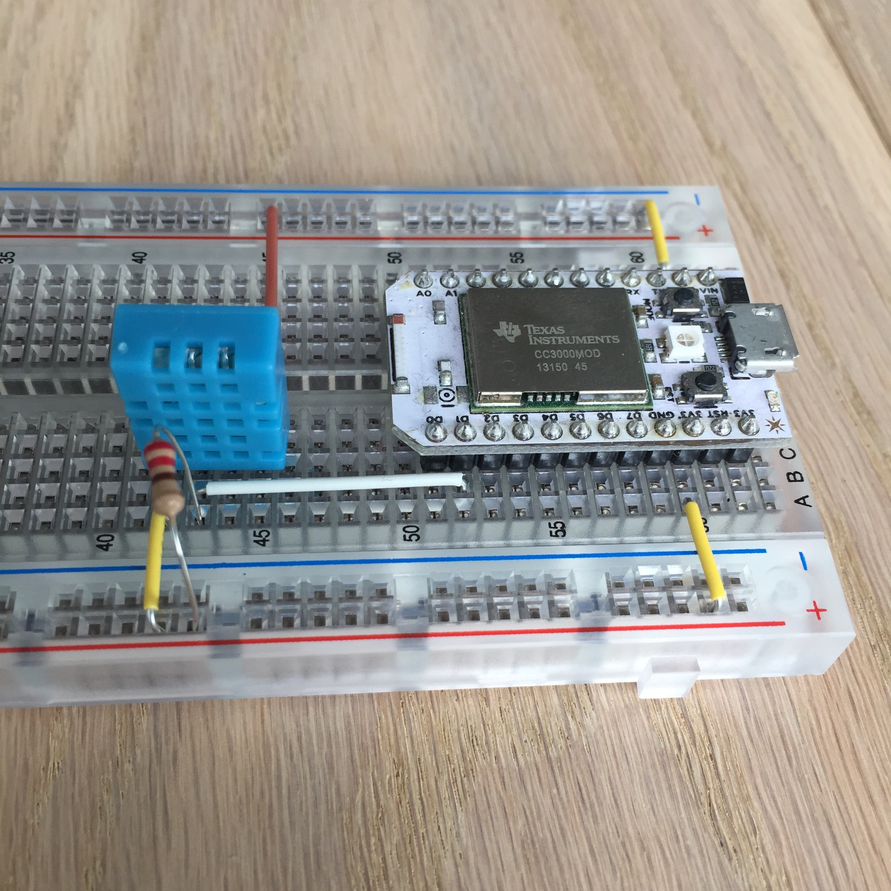

# dht-monitor

A Digitial Humitity and Temperature Monitor using a Spark Core (newer version is a Particle Photon) and a DHT11 sensor.

This is what the prototyped project looks like. Pretty simple!



## Particle Commands

This project creates two Particle variables: `temperature` and `humidity`

Additionally using the `start` and `stop` commands with the `publish` function you can obtain a stream of Particle events of regularaly updated temperature changes.

### URL examples

Get the current temperature
`$ curl -G https://api.spark.io/v1/devices/<device id>/temperature -d access_token=<access token>`

Get the current humidity
`$ curl -G https://api.spark.io/v1/devices/<device id>/humidity -d access_token=<access token>`

Start publishing changes to temerature and humidity at most once a minute
`$ curl https://api.spark.io/v1/devices/<device id>/publish -d access_token=<access token> -d args=start`

Stop publishing
`$ curl https://api.spark.io/v1/devices/<device id>/publish -d access_token=<access token> -d args=stop`

## A tour of the project

#### ```/src``` folder:  
This is the source folder that contains the firmware files for your project. It should *not* be renamed. 
Anything that is in this folder when you compile your project will be sent to our compile service and compiled into a firmware binary for the Particle device that you have targeted.

If your application contains multiple files, they should all be included in the `src` folder. If your firmware depends on Particle libraries, those dependencies are specified in the `project.properties` file referenced below.

#### ```.ino``` file:
This file is the firmware that will run as the primary application on your Particle device. It contains a `setup()` and `loop()` function, and can be written in Wiring or C/C++. For more information about using the Particle firmware API to create firmware for your Particle device, refer to the [Firmware Reference](https://docs.particle.io/reference/firmware/) section of the Particle documentation.

#### ```project.properties``` file:  
This is the file that specifies the name and version number of the libraries that your project depends on. Dependencies are added automatically to your `project.properties` file when you add a library to a project using the `particle library add` command in the CLI or add a library in the Desktop IDE.

## Adding additional files to your project

#### Projects with multiple sources
If you would like add additional files to your application, they should be added to the `/src` folder. All files in the `/src` folder will be sent to the Particle Cloud to produce a compiled binary.

#### Projects with external libraries
If your project includes a library that has not been registered in the Particle libraries system, you should create a new folder named `/lib/<libraryname>/src` under `/<project dir>` and add the `.h` and `.cpp` files for your library there. All contents of the `/lib` folder and subfolders will also be sent to the Cloud for compilation.

## Compiling your project

When you're ready to compile your project, make sure you have the correct Particle device target selected and run `particle compile <platform>` in the CLI or click the Compile button in the Desktop IDE. The following files in your project folder will be sent to the compile service:

- Everything in the `/src` folder, including your `.ino` application file
- The `project.properties` file for your project
- Any libraries stored under `lib/<libraryname>/src`
